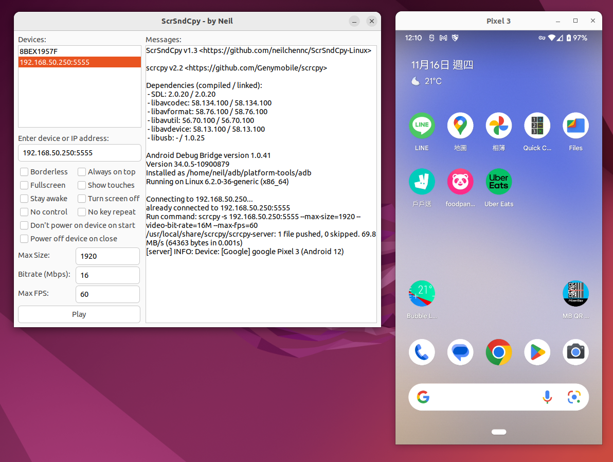

# ScrSndCpy (Linux)

*ScrSndCpy = **Scr**een **S**ou**nd** **C**o**py***

A Linux (Ubuntu/Debian) GUI application executes both [scrcpy](https://github.com/Genymobile/scrcpy) and [sndcpy](https://github.com/rom1v/sndcpy) simultaneously, used to display screen, sound and control Android phones or tablets.



*Looking for Windows version? [Click here](https://github.com/neilchennc/ScrSndCpy-Windows)*

## About scrcpy and sndcpy

[scrcpy](https://github.com/Genymobile/scrcpy) (Screen Copy) is an application provides display and control of Android devices connected via USB or over TCP/IP (requires at least Android 5.0) which developed by Genymobile.

[sndcpy](https://github.com/rom1v/sndcpy) (Sound Copy) is an application forwards audio from an Android device to the computer (requires at least Android 10, and [VLC](https://www.videolan.org/) must be installed on the PC) which developed by rom1v.

Both of them do NOT require any root access.

## Requirements

- Linux (Ubuntu/Debian)

- Android 5.0+ (or Android 10+ if you want audio output)

- [VLC](https://www.videolan.org/) installed (install on PC, for audio output)

## Download

[TODO]

## How to use

Your Android devices must [enable debugging mode](https://developer.android.com/studio/command-line/adb.html#Enabling) before using ScrSndCpy, or find [tutorial videos on YouTube](https://www.youtube.com/results?search_query=android+enable+usb+debugging).

Install scrcpy:

```bash
sudo apt install scrcpy
```

Install VLC (for audio output):

```bash
sudo apt install vlc
```

Download latest ScrSndCpy and extract it

Run **ScrSndCpy**

### Connect via USB

- Plug your Android devices with USB cable

- You device will popup a USB debugging confirmation dialog, click "Allow" button

- In ScrSndCpy, select a device in the ScrSndCpy

- Click **Play** button

### Connect via Wi-Fi (TCP/IP)

- Connect to Wi-Fi access point, note that your PC must connect to the same access point (network segment)

- In the ScrSndCpy, enter Android device's IP address

- Click **Play** button

- You device will popup a USB debugging confirmation dialog, click "Allow" button

- Click **Play** button again

You can check out [scrcpy](https://github.com/Genymobile/scrcpy) and [sndcpy](https://github.com/rom1v/sndcpy) for more introductions, functions and controls.

## Development environment

- OS: Ubuntu 20.04

- Graphic lib: GTK3

- UI design: Glade

- Language: C

- IDE: Visual Studio Code
